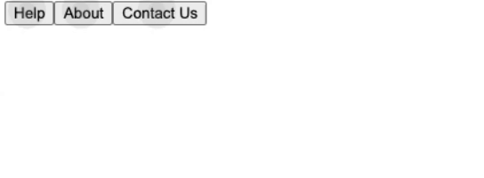

# 一天一套件 - intro.js(2)

今天要介紹的是昨天沒說的:Hints，基本上功能跟 Step 一樣，如果還不知道 Steps 的讀者，可以先去看一下昨天的[文章]()

## 什麼是 Hints?

Hints 跟 Steps 一樣，是一個頁面導覽的功能，不過兩者顯示的效果有所不同，Steps 是有順序的，而 Hints 是沒順序的(同時提示)

## 環境安裝

```js
npm install intro.js --save
npm install intro.js-react
```

跟昨天一樣，都是下載這兩個套件(絕對不是筆者在增加字數，是怕有人沒看過昨天的文章拉，用心良苦，你們還不懂嗎？)

## 怎麼使用？

首先跟 Steps 一樣，Hints 也是一個 Component

```js
<Hints enabled hints={hints} />
```

常見的只有兩個:

### enabled

跟 Steps 的 enabled 一樣，是決定要不要顯示的關鍵元素，如果設定為 false 就不會顯示，所以工作上可以考慮給他一個 state 透過條件式，來決定是否開啟

### hints

可以想像成 Steps 裡的 intro，一樣是跟畫面元素作綁定，並且設定提示文字

```js
const hints = [
  {
    element: "#help",
    hint: "test 1",
    hintPosition: "middle-middle",
  },
  {
    element: "#about",
    hint: "test 2",
  },
  {
    element: "#contact",
    hint: "test 3",
  },
];

<button id="help">Help</button>
<button id="about">About</button>
<button id="contact">Contact Us</button>
```

## 成品



## 結語

這篇比較短，是因為 Hints 本身功能就不多

筆者個人必較喜歡使用 Steps 因為感覺更人性化一點，不然一進去頁面一堆地方叫使用者按，不說其他的，單就 UX 分數一定很低

> 以上就是今天的文章，一樣有問題歡迎在下方留言
