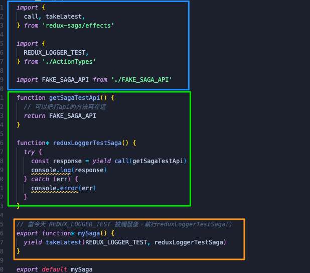

# 一天一套件，工作沒煩惱 - Redux-saga

今天我們要介紹的是 Redux-saga

## 什麼是 Redux-saga

相信 React 開發者都會遇到需要處理非同步的問題，例如當我們需要打 api 的時候，這時候其實有很多方式可以處理，而 Redux-saga 就是處理的其中一種方式

這邊可能有些讀者有聽過 Redux-thunk，這個套件我們明天會講到，今天先來看 saga

## 環境安裝

```js
npm install redux-saga
```

安裝好以後，我們需要到 store 裡面把它加進去，因為 saga 也算是 middleware

```js
import { createStore, applyMiddleware } from "redux";
import createSagaMiddleware from "redux-saga";

import reducer from "./reducers";
import mySaga from "./sagas";

// create the saga middleware
const sagaMiddleware = createSagaMiddleware();
// mount it on the Store
const store = createStore(reducer, applyMiddleware(sagaMiddleware));

// then run the saga
sagaMiddleware.run(mySaga);

// render the application
```

以上程式碼是來自[官網](https://redux-saga.js.org/)

可以看到我們需要先建立一個`sagaMiddleware`，並且包到`applyMiddleware`裡面，並且要去單獨`run`我們定義好的`sagaMiddleware`

以上是基本的 saga 配置，接下來我們來試玩看看 saga

> 這邊提醒一下，請讀者先行部署好 Redux 的環境，方便後面操作喔~~

## 怎麼使用

在開始前我們要先了解，redux-saga 是**在哪裡執行**的


以上圖片取自[掘金](https://juejin.cn/post/6931308713345024008)

由圖片我們可以看到他是在 store 到 reducer 時執行的，這個執行時間很重要，因為會影響到寫法，這個等到後面 Redux-thunk 時，讀者就會了解我在說什麼了

暸解執行時間後，我們就可以開始實作拉:

基本上 saga 我會分成三大區塊



### 引入區 - 藍色框框

基本上就是引入需要的套件、或元件，這邊就不多做著墨

### 執行區 - 綠色框框

function 書寫區域，有幾個 saga 提供的 Api:

- put
- call
- yield
- delay
- select
- race
- fork
- cancelled
- cancel

這邊我只會針對常用的幾個做介紹

### put

可以透過 put 這個方法來產生 dispatch Effect 來更新 store 中的資料

```js
put(reduxLoggerTest());
```

### call

call 可以讓我們去執行一段 function，第二個參數開始則是執行 Function 的參數

### yield

yield 可以讓我們在執行中喊停，等到程式被執行完成，才往下走

### delay

```js
yield delay(1000);
```

這可語法是可以讓你做延遲，後面是需要延遲的秒數，通常會搭配 yield 去使用

### 監聽區 - 橘色框框

```js
export function* mySaga() {
  yield takeLatest(REDUX_LOGGER_TEST, reduxLoggerTestSaga);
}
```

這邊有兩關鍵字:

- takeLatest - 如果多次觸發 type 為 `REDUX_LOGGER_TEST` 的 action 時，會以最後一次的回應為準，在之前還未完成（如，pending）的 `reduxLoggerTestSaga` 將會被取消。
- takeEvery - 每次觸發 type 為 `REDUX_LOGGER_TEST` 的 action 時都會執行 `reduxLoggerTestSaga`

## 結語

以上就是 Redux-saga 的基礎介紹，明天會接著介紹 Redux-thunk，並且最後一樣會有兩者的小比較，所以可以期待一下，那一樣如果有任何問題，都可以在下方留言

參考資料:

https://juejin.cn/post/6931308713345024008

https://medium.com/enjoy-life-enjoy-coding/redux-saga-redux-%E7%95%8C%E7%9A%84%E9%9D%9E%E5%90%8C%E6%AD%A5%E6%95%91%E6%98%9F-%E5%9F%BA%E6%9C%AC%E7%94%A8%E6%B3%95-d38ce3e64308

https://pjchender.dev/react/redux-saga/
