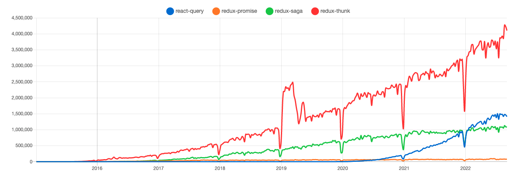

# 一天一套件，工作沒煩惱 - React-Query

今天要介紹的是 React-Query，這個套件可能會比較冷門，至少目前我沒有在工作使用過的經驗

## 什麼是 React-Query

今天你如果使用過 Redux-saga，你會發現 reducers 中分散了各類的 state，也就是同步的 state 和非同步的 state 混雜再一起。

React-Query 將資料分成 Client state 和 Server State，Client state 就是 Web App 內部狀態，例如：使用者選擇的 theme、language，而 Server State 是需要經過非同步獲取的 state，像是 call API 得到的 data，React Query 就是為了更好的處理 Server State 而出現

## 環境安裝

```
npm i react-query
```

然後需要在最外層包一個`QueryClientProvider`

```js
import { QueryClient, QueryClientProvider } from "react-query";
import { getTodos, postTodo } from "../my-api";

// 创建一个 client
const queryClient = new QueryClient();

function App() {
  return (
    // 提供 client 至 App
    <QueryClientProvider client={queryClient}>
      <Todos />
    </QueryClientProvider>
  );
}
```

以上程式碼取自[官網](https://cangsdarm.github.io/react-query-web-i18n/)

## 趨勢



[Link](https://npmtrends.com/react-query-vs-redux-promise-vs-redux-saga-vs-redux-thunk)

從上圖我們可以看到在今年的時候 React-query 使用量已經超過 Redux-saga 了，不過讓我意外的是 Redux-thunk 居然有這麼多的使用者，目前看起來 Redux-saga 或是 React-query 短期間內要超過 Redux-thunk 應該是不太可能

## 怎麼使用

基本上有三個核心觀念：queries, mutations, query-invalidation，且我們今天只會講常用的兩個

## queries - 查詢

[官網](https://cangsdarm.github.io/react-query-web-i18n/guides&concepts/queries/)

```js
import React from "react";
import { useQuery } from "react-query";

const fetchPlanets = async () => {
  const res = await fetch(`YOUR URL`);
  return res.json();
};

export default function Planets() {
  const { data, status, isLoading, isError, isSuccess } = useQuery(
    "planets",
    fetchPlanets
  );
  console.log({ data, status, isLoading, isError });
  return (
    <div>
      <h2>Planets</h2>
    </div>
  );
}
```

useQuery 只接受幾種狀態 `data`, `status`, `isLoading`, `isError`, `isSuccess`

## data

這是 api 返回回來的資料

### status：狀態

基本上會有四種狀態

```js
state === "Loading"; // isLoading
state === "error"; // isError
state === "success"; // isSuccess
state === "idle"; // isIdle 禁用狀態
```

### isLoading

查看是否為 Loading 狀態，或是也可以寫成`state === 'Loading'`

### isError

查看是否為 Error 狀態，或是也可以寫成`state === 'Error'`

### isSuccess

如果成功會回傳 true

## mutations - 修改

[官網](https://cangsdarm.github.io/react-query-web-i18n/guides&concepts/mutations/)

```js
function App() {
  const mutation = useMutation((newTodo) => axios.post("/todos", newTodo));

  return (
    <div>
      {mutation.isLoading ? (
        "Adding todo..."
      ) : (
        <>
          {mutation.isError ? (
            <div>An error occurred: {mutation.error.message}</div>
          ) : null}

          {mutation.isSuccess ? <div>Todo added!</div> : null}

          <button
            onClick={() => {
              mutation.mutate({ id: new Date(), title: "Do Laundry" });
            }}
          >
            Create Todo
          </button>
        </>
      )}
    </div>
  );
}
```

以上程式碼取自[官網](https://cangsdarm.github.io/react-query-web-i18n/guides&concepts/mutations/)

基本使用方法都跟 queries 一樣，不過 mutations 可以做變動，我們可以透過`.mutate`來做更改

## 結語

我自己使用下來其實蠻喜歡這個套件的，因為以往我們可能要去監聽 Loading 或是 Error 狀態，而寫了很多的 reducer，透過 React-Query 可以讓我們直接取得狀態，只有一個爽字啊！

> 以上就是今天的文章，一樣有問題，歡迎在下方留言

參考文章:

https://chihyang41.github.io/2020/09/07/React-Query-Tutorial/

https://pjchender.dev/npm/npm-react-query/
