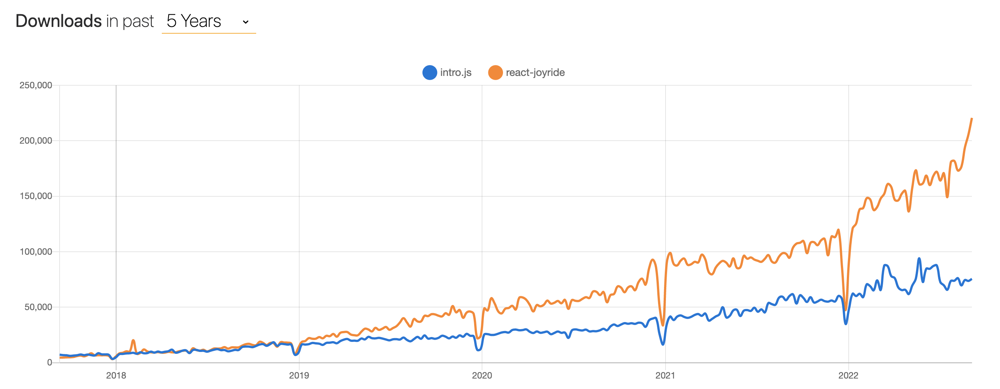
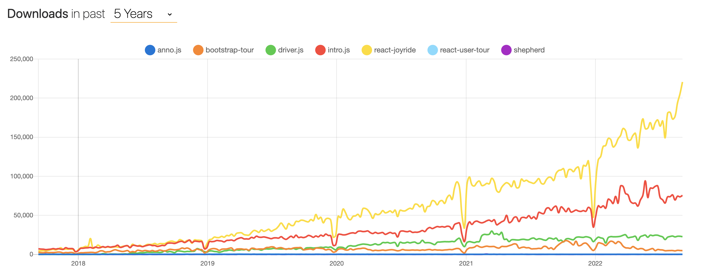

# react-joyride

今天要介紹的是跟 intro.js 很像的套件，一樣在處理導覽功能

## 什麼是 react-joyride

他的名字命名的不錯，Joyride 就是兜風，想表達的意思可能是說透過這個套件，帶你去兜風，讓你可以在最短的時間內熟悉這個網站

不過在開始前，我想先說一下，我自己在玩這個專案時，覺得他的[官網](https://react-joyride.com/)也太簡陋了吧，後來才看到他的[正式文件](https://docs.react-joyride.com/)是在 Github 裡面，讓我第一印象不太好

## react-joyride vs intro.js

今天不講寫法，或是上手難易度，單純只看使用人數的話，可以看到差異其實有拉大的感覺，尤其今年更過明顯，react-joyride 遠多於 intro.js 了，所以我才會回來補這篇啊！



至於其他的相關套件因為使用率真的不太高，有些甚至都已經沒有在維護了，所以這篇就當作頁面導覽的最後一篇吧



## 環境安裝

```
npm i react-joyride
```

## 怎麼使用?

```js
function ReactJoyride() {
  const steps = [
    {
      title: "我是標題",
      target: ".my-first-step",
      content: "我是內容",
      hideCloseButton: true,
      disableBeacon: true,
      locale: {
        next: "下一步",
        skip: "跳過",
        close: "關閉",
      },
    },
    {
      title: "我是標題",
      target: ".my-other-step",
      content: "我是內容",
      hideCloseButton: true,
      disableBeacon: true,
      locale: {
        back: "上一步",
        next: "下一步",
        skip: "跳過",
        close: "關閉",
      },
    },
  ];
  return (
    <>
      <Joyride steps={steps} run={true} />
      <button type="button" className="my-first-step">
        button 1
      </button>
      <button type="button" className="my-other-step">
        button 2
      </button>
    </>
  );
}
```

因為他的 API 很多，所以不會全講，如果有需要可以參考[官網](https://docs.react-joyride.com/)，裡面都寫得很清楚

筆者自己在寫`react-joyride`時，會分成兩部分: `Joyride`, `steps`，也就是官網裡面的 Props 跟 Step

## Joyride

這裡面存放的資料，會是基本的資料，像是你想要的順序，或是你希望你的提示什麼時候可以出現，常用的 Props 是 steps 跟 run

```js
<Joyride steps={steps} run={true} />
```

- steps 決定了你的提示框所有的內容，包含文字、顏色，或是是否預設顯示

- run 決定你是否使用 react-joyride 這個套件，如果今天寫一個 false，那麼無論你怎麼點都不會觸發，所以建議搭配一個 state，由畫面去影響是否觸發

## steps

steps 決定了你的提示框裡面要做怎麼效果，或是顯示什麼文字，這邊的概念跟 intro.js 很像，都是傳遞一個 steps 去決定順序，也就是說今天如果把`.my-other-ste`搬到前面，執行順序也會跟著變更喔

```js
const steps = [
  {
    title: "我是標題",
    target: ".my-first-step",
    content: "我是內容",
    hideCloseButton: true,
    disableBeacon: true,
    locale: {
      next: "下一步",
      skip: "跳過",
      close: "關閉",
    },
  },
  {
    title: "我是標題2",
    target: ".my-other-step",
    content: "我是內容2",
    hideCloseButton: true,
    disableBeacon: true,
    locale: {
      back: "上一步",
      next: "下一步",
      skip: "跳過",
      close: "關閉",
    },
  },
];
```

steps 裡面有很多的參數，這邊我只講上面幾個，一樣如果有其他需求的話，可以去官網找找看，基本上都可以找到

- title: 標題
- target: 綁定目標，這邊注意一下，記得 class 或 id，要是該頁面唯一的，不然可能會同時觸發多個喔
- content: 要提示的文字
- hideCloseButton: 隱藏關閉按鈕
- disableBeacon: 這個預設是 false，也就是會有提示，請使用者去點擊，有點像 intro.js 的 Hints，如果今天改成 true，就會是開啟頁面顯示
- locale: 這是按鈕的 i18n，由我們自己去定義幾個常用的按鈕，如果都沒設定的話，會使用預設值

```js
{ back: 'Back', close: 'Close', last: 'Last', next: 'Next', open: 'Open the dialog', skip: 'Skip' }
```

圖片顯示

參考文章:

https://juejin.cn/post/7072178832064643080
