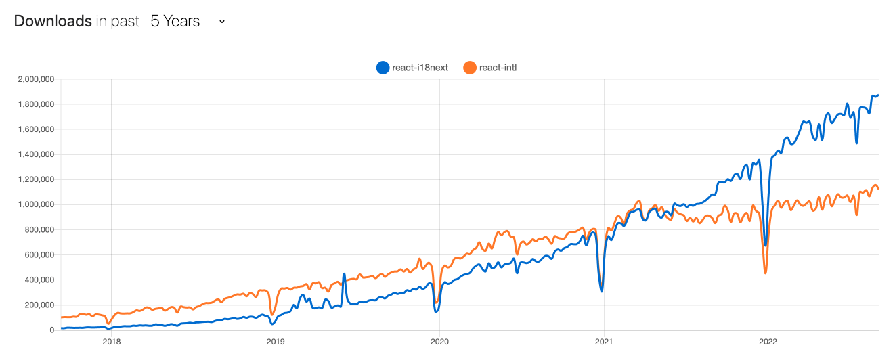

# react-i18next

今天會延續昨天的 i18n，介紹一個也很熱門的套件 - react-i18next

## 什麼是 react-i18next

react-i18next 是跟 react-intl 一樣功能的套件，都是在處理網頁的 i18n

## react-i18next vs react-intl

老樣子遇到類似套件，我們都要給他比較一下



[Link](https://npmtrends.com/react-i18next-vs-react-intl)

可以看到 react-i18next 的使用人數略高於 react-intl，並且有逐漸拉大差距的趨勢

## 環境安裝

```
npm install react-i18next i18next --save
```

這邊可以看到是安裝了兩個套件`react-i18next`跟`i18next`

## 怎麼使用

安裝好以後，我們首先進入`index.js`裡面加入

```js
import "./i18n";
```

沒錯，不用懷疑，相比之下 `react-intl` 的 `intlProvider` 感覺就厚重很多

接著我們需創立一個`i18n.js`的檔案，他會是我們`react-i18next`的設定檔

```js
import i18n from "i18next";
import { initReactI18next } from "react-i18next";

import en from "../public/locales/en.json"; // 這個路徑可以自己定義，不需要跟筆者一樣
import zh_tw from "../public/locales/zh_TW.json";
import thai from "../public/locales/thai.json";

const resources = {
  en: {
    translation: en,
  },
  thai: {
    translation: thai,
  },
  zh: {
    translation: zh_tw,
  },
};

i18n.use(initReactI18next).init({
  resources, // 會是所有翻譯資源
  fallbackLng: "en", // 如果當前切換的語言沒有對應的翻譯則使用這個語言
  lng: "en", // 預設語言
  interpolation: {
    // 是否要讓字詞 escaped 來防止 xss 攻擊，這裡因為 React.js 已經做了，就設成 false即可
    escapeValue: false,
  },
});

export default i18n;
```

這就是基本配置，不過這邊我略過一個步驟，就是要先建立:`en.json`, `zh_TW.json`, `thai.json`

(今天特別翻譯了一個泰文，不知道各位有沒有發現)

基本格式會長這樣:

```json
// en.json
{
  "hello": "hello!",
  "link": "Let's learn React here"
}

// zh_TW.json
{
    "hello": "你好!",
    "link": "一起來 這裡 學習 React 吧"
}

// thai.json
{
    "hello": "สวัสดี!",
    "link": "มาเรียนรู้ React ด้วยกัน  ที่นี่"
}
```

一樣是 key-value，到時候要翻譯時，會去找到一樣的 key，然後顯示 value 的部分

基本設定好了以後，進入到頁面，我們要讓翻譯的字，顯示在畫面上

我們需要透過 react-i18next 提供的一個 Hook: `useTranslation`，或是透過 HOC 的方式: `Translation`，來做顯示

Hook:

```js
import { useTranslation } from "react-i18next";

const { t } = useTranslation();

t("hello"); // hello!
```

`t` 裡面要包的是語言包裡面的 `Key`

HOC:

```js
import { Translation } from "react-i18next";

<Translation>{() => <p>{t("hello")}</p>}</Translation>;
```

以上是基本的翻譯部分，不過我們今天需要可以自己轉換語系，那就會需要用到 react-i18next 提供的 `changeLanguage`

```js
語法:
i18n.changeLanguage("en");


範例:
<button onClick={() => i18n.changeLanguage('en')} type="button">
    英文
</button>
<button onClick={() => i18n.changeLanguage('zh')} type="button">
    中文
</button>
<button onClick={() => i18n.changeLanguage('thai')} type="button">
    泰文
</button>
```

也可以透過其他方式轉換語系，這邊就交給讀者自己去發揮了

不過要特別注意一下，裡面包的`en`，是設定檔裡面 resources 的資料，而不是你的翻譯資料夾的名稱喔

## 結語

以上就是 react-i18next 簡單的教學，筆者自己使用過兩種套件(react-intl, react-i18next)，使用起來其實大同小異，不過 react-i18next 寫法更為清爽一點，不愧是使用率較高的套件

> 一樣有任何問題，都歡迎在下方留言

參考文件:

https://ryanote.netlify.app/posts/React-i18next
