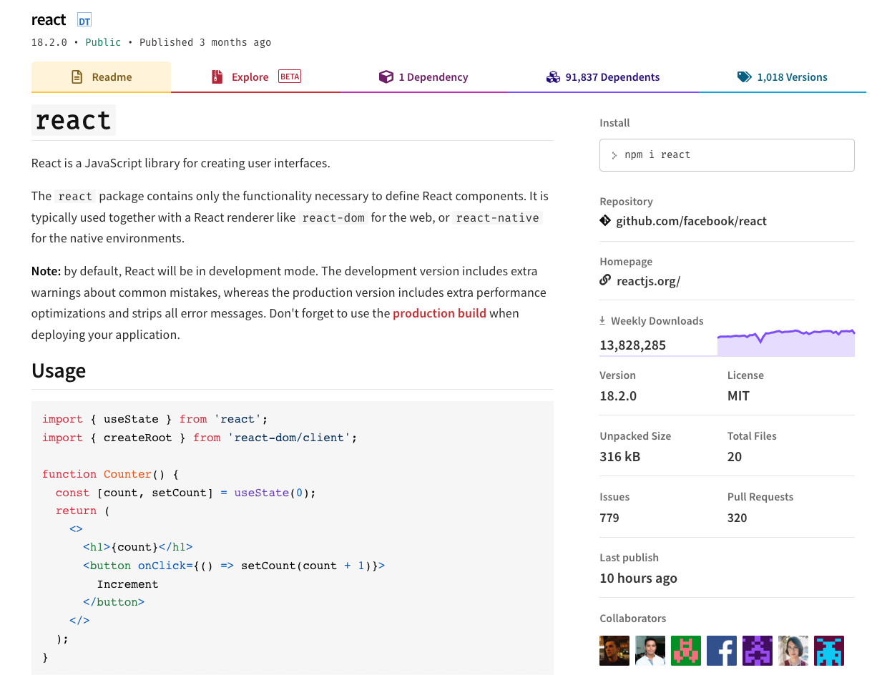
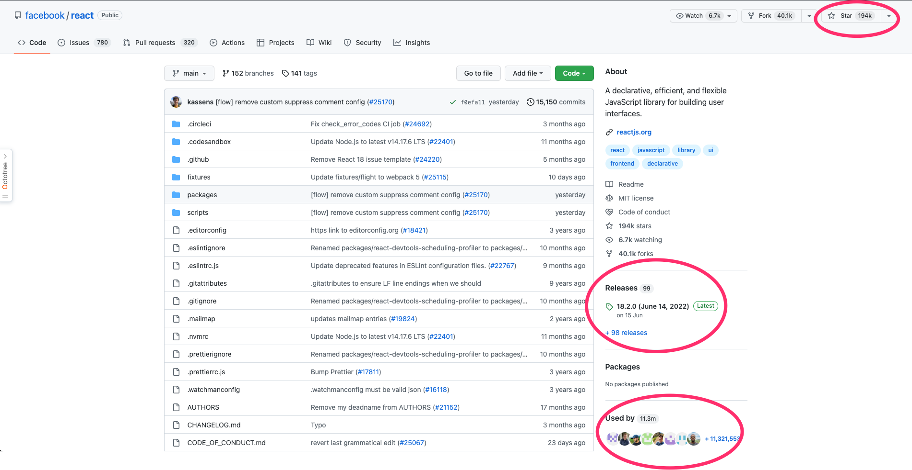

# 關於選擇套件你必須知道的事

今天我想說明一下，該如何去挑選套件，並且這都是我個人習慣，所以如果有其他挑選方式，歡迎留言給我，謝謝

## 為什麼要討論這個問題？

主要是因為套件也是需要有人去維護，或是新增功能，這樣套件才會越來越完善，所以我們在選擇套件要考慮到幾個面向:

1. 上次更新是什麼時候
2. 有多少人使用

## [NPM](https://www.npmjs.com/)

可以看到右方資訊欄，有幾個關鍵字

**Weekly Downloads (有多少人使用)**

代表每週有多少人下載，當然越多人越好，代表這個套件的社群也相對龐大，有問題時網路上基本上也都會有相關回答

**Last publish (上次更新是什麼時候)**

最新一次的 commit 時間，可看到 React 在 10 小時前有做更新，代表還有人在維護，如果看到有些套件已經 3, 4 年沒維護，在選擇時就需要慎重考慮，因為如果遇到問題也會沒版法解決

## Github

以上資訊也可以在 Github 上面看到

可以在圖片裡面看到我圈起來的部分，分別是:

### Star

有點像 Github 裡面的按讚功能，所以如果 Star 越多，代表越多人支持這個套件

### Releases

最新發佈時間，時間如果裡目前時間越近，代表還有在維護

### Used by

代表著有多少人使用者個套件

## 結論

筆者自己就曾經遇過套件停更很久，導致當下專案沒辦法完成 PM 的需求，運氣好的話，PM 可能可能會跟你討論這個功能的需求性，然後使用替代方案，運氣差一點，一定要這個效果的話，可能就會需要換套件，因為停更很久，你發 issue 或是 PR，也不太可能會有人理你

> 以上就是今天的內容，如果有任何錯誤，歡迎留言在下方～～
