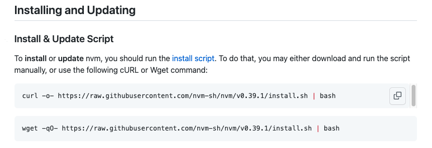

## NVM

[Github 連結](https://github.com/nvm-sh/nvm#installing-and-updating)

NVM 是 `Node Version Manager` 的縮寫，可以了解這是一個跟 Node 版本控制有關係的套件，他讓我們可以自由的切換到自己想要的版本號

## 為什麼需要 NVM?

當某個特定專案需要使用指定版本時，我們不可能去 uninstall 現有版本，然後 install 指定版本，這樣很沒效率，為了解決這個問題，我們就會需要使用到 NVM，她讓我們可以永有多個 Node 版本，讓我們可以自己選擇現在要用到的版本號

## 環境安裝

首先我們需要先下載 NVM

不過因為 NVM 不是透過 Node 去做下載，所以 Windows 這邊我沒辦法演示，但別擔心我有放[連結](https://github.com/coreybutler/nvm-windows/releases)，方便 Windows 的讀者去做下載

MAC:

先在 Terminal，書入以下指令:

```js
curl -o- https://raw.githubusercontent.com/nvm-sh/nvm/v0.39.1/install.sh | bash
```

也可以到官網找到以下指令


現在就可以確認有沒有下載成功

```
nvm
```

如果現在出現類似 `zsh: command not found: nvm` 的錯誤訊息出現

記得到你的 ~/.bashrc, ~/.profile, 或是 ~/.zshrc 檔案裡面加入

```js
export NVM_DIR="$HOME/.nvm"
[ -s "$NVM_DIR/nvm.sh" ] && \. "$NVM_DIR/nvm.sh"
[ -s "$NVM_DIR/bash_completion" ] && \. "$NVM_DIR/bash_completion"bash_completion
```


加入以上指令後，回到 Terminal，一樣下`nvm`指令


如果顯示以上文字代表你已經成功下載 NVM

## 如何使用

下載完之後，終於到了使用的環節了

這邊[官網](https://github.com/nvm-sh/nvm#usage)其實有寫得很清楚了


## 常用的指令

### nvm install node - 下載 Node 版本

```js
nvm install 16.15
```

### nvm ls-remote - 可以看 Node 所有的版本


p.s. 因為太多了，所以我沒有全部截起來

其中會有一些版本號跟其他的不太一樣


藍色部分是你目前擁有的 Node 版本號

### nvm ls - 可以看自己擁有哪些版本


其中綠色箭頭就是目前使用的版本

### nvm use node-version - 可以切換到指定版本

透過上方指令我們可以看到目前擁有的 Node 版本，並使用`nvm use node-version`可以切換到指定版本


### nvm alias default node - 將某一個版本當作預設版本

今天如果想要使用特定版本的話可以使用上方指令

以上就是今天的內容，如果有任何錯誤，歡迎留言在下方～～

那我們明天見～～

參考資料:

https://www.casper.tw/development/2022/01/10/install-nvm/

https://github.com/nvm-sh/nvm

https://medium.com/@123davidbill/%E5%B0%8F%E5%AD%A9%E5%AD%90%E6%89%8D%E5%81%9A%E9%81%B8%E6%93%87-%E6%88%91%E5%85%A8%E9%83%BD%E8%A6%81-%E5%A4%9A%E5%80%8Bnode%E7%89%88%E6%9C%AC%E8%87%AA%E7%94%B1%E5%88%87%E6%8F%9B-82b0fa9f6522
