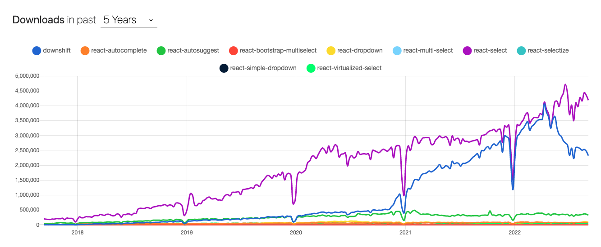
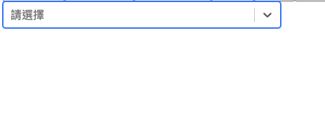
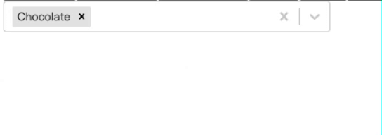
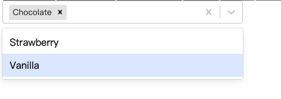

# 一天一套件，工作沒煩惱 - react-select

今天要介紹的套件是 react-select

## 為什麼需要 react-select?

與其說為什麼需要，我覺得我會更傾向於說什麼時候需要：今天如果你有多個內容需要讓使用者去選擇，但又不想要影響到畫面美觀，就可以使用 react-select！它能用最小的空間帶來最大的效益

然後要跟大家講個好消息，因為 react-select 在 select 套件中，幾乎沒有可比擬的對手了，所以 select 的部分我們只會講一個套件，不過如果有其他使用率很高的 select 套件，可以留言在下方，讓我知道，謝謝


[Link](https://npmtrends.com/downshift-vs-react-autocomplete-vs-react-autosuggest-vs-react-bootstrap-multiselect-vs-react-dropdown-vs-react-multi-select-vs-react-select-vs-react-selectize-vs-react-simple-dropdown-vs-react-virtualized-select-vs-react-widgets)

downshift 今年感覺有起來了一下，不過又下去了，筆者自己也還在觀望中

p.s 看了一下 downshift，是透過 Hooks 去實作的，但感覺不太直觀，目前應該還會是 react-select 的天下

## 環境安裝

```
npm i --save react-select
```

## 怎麼使用

```js
import React from "react";
import Select from "react-select";

const options = [
  { value: "chocolate", label: "Chocolate" },
  { value: "strawberry", label: "Strawberry" },
  { value: "vanilla", label: "Vanilla" },
];

const MyComponent = () => <Select options={options} />;
```

上方程式碼是取自[官網](https://react-select.com/home)，等一下所有的教學都會從這裡延伸

## Props

react-select 可以想像是一個 React Component ，我們如果有想要用的功能，就用 Props 傳遞進去，那麼接下來會來講簡單的幾個 Props，方便大家了解這個套件

## options

react-select 中最重要的存在，承載著所有的資料，不過這邊要特別注意:

> react-select 中的 options 只會取`value`跟`label`

你如果傳遞`id`或是`name`他是不會有效果的，所以記得如果後端回來的資料格式不是`value`跟`label`，記得要在使用前先做轉 key 的動作，不然你會發現你的下拉選單會是白的

## onChange

react-select 中，如果要知道使用者選取的值，我們可以使用 onChange 去坐監聽

```js
const [chooseItem, setChooseItem] = useState('')

... 以下略

<Select
    options={options}
    onChange={(item) => setChooseItem(item.value)}
/>
```

## placeholder

使用 placeholder，可以讓你預設顯示某一個定的字眼，例如我在`placeholder`裡面輸入`請選擇`

```js
<Select
  options={options}
  onChange={(item) => setChooseItem(item.value)}
  placeholder="請選擇"
/>
```



## defaultValue

defaultValue 可以讓你預設顯示 List 中的其中一條，不過要特別注意，不能和 placeholder 共用，這樣 placeholder 會沒有效果(兩者都寫的話，會顯示 `defaultValue`)

```js
<Select
  options={options}
  onChange={(item) => setChooseItem(item.value)}
  efaultValue={options[0]}
/>
```

## isMulti

預設為: false

isMulti，可以讓你的下拉選單可選擇不止一筆


## closeMenuOnSelect

預設為: true

當今天將 isMulti 預設為 true 時，每次選完下拉式選單都會關閉，如果想選其他的，就需要再把下拉式選單打開，透過 closeMenuOnSelect，我們可以自幾覺定是否要將下拉是選單關閉

```js
<Select
  options={options}
  onChange={(item) => setChooseItem(item.value)}
  efaultValue={options[0]}
  closeMenuOnSelect={false}
/>
```



## defaultMenuIsOpen

預設為: false

透過 defaultMenuIsOpen 這個語法，我們可以讓下拉式選單預設是打開的

```js
<Select
  options={options}
  onChange={(item) => setChooseItem(item.value)}
  efaultValue={options[0]}
  closeMenuOnSelect={true}
/>
```



## autoFocus

預設是: false

今天如果將 autoFocus 改成 true，將會預設 focus 到該下拉式選單

## 結語

其實 react-select 還有很多不同的 Props 跟功能，不過礙於篇幅，我就挑幾個工作常用的部分來說明，如果有興趣的讀者可以去[官網](https://react-select.com/home)裡面看看，基本上這個套件的命名都不會太難懂，按著英文去翻譯應該都會了解大概是怎麼用途

> 以上就是今天的文章，如果有任何錯誤、或是不了解的地方，都歡迎在下方留言，我們明天見~~
