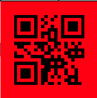
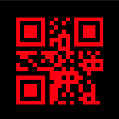

# qrcode.react

今天要介紹的套件是 qrcode.react

## 什麼是 qrcode.react?

從名字其實就可以知道他是跟 QRcode 有關的套件，qrcode.react 提供簡單的方法，去生成 QRcode

## 環境安裝

```
npm i qrcode.react
```

## 語法比較

基本上分成: `QRCodeSVG`, `QRCodeCanvas`, `QRCode`

不過 QRCode 目前已經棄用，所以接下來會來講`QRCodeSVG`跟`QRCodeCanvas`

### QRCodeSVG vs QRCodeCanvas

> SVG is generally recommended as it is more flexible, but Canvas may be preferable.

官方建議大家使用 `QRCodeSVG`，因為他更靈活

## 基本用法

```js
import ReactDOM from "react-dom";
import { QRCodeSVG } from "qrcode.react";

ReactDOM.render(
  <QRCodeSVG value="https://reactjs.org/" />,
  document.getElementById("mountNode")
);

import ReactDOM from "react-dom";
import { QRCodeCanvas } from "qrcode.react";

ReactDOM.render(
  <QRCodeCanvas value="https://reactjs.org/" />,
  document.getElementById("mountNode")
);
```

這邊看到`QRCodeSVG`跟`QRCodeCanvas`的用法是一樣的，且最基本的用法就是透過`value`，將想變成 QRcode 的內容傳遞到 Component 中

### Props

- value: 最終要的部分，沒有的話也無法生成 QRcode

- size: QRcode 的大小
- bgColor: 背景顏色，這邊我特別將背景改成紅色

  

- fgColor: 文字顏色，這邊我們將文字改成紅色

  

- level: QRcode 大小，是指中間黑色部分的密集度


圖片取自官網

- includeMargin: 是否包含 Margin

可以看到圖一跟圖三的必較，圖一明顯多出了外面一層，那就是所謂的 Margin

## 結語

以上就是 qrcode.react 的簡單用法，會使用以後就可以去建立個人的 QRcode 拉

> 有問題歡迎在下方留言，我們明天見
