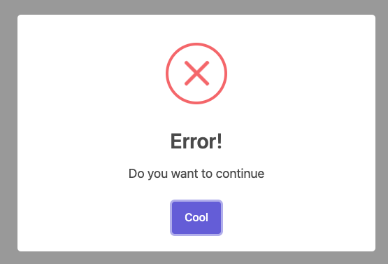
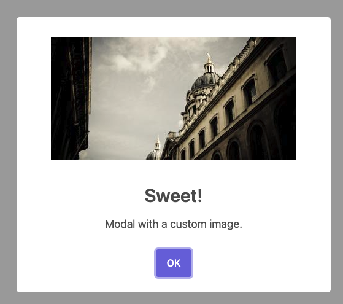

# sweetalert2

## 什麼是 sweetalert2

sweetalert 翻成中文應該是"甜蜜的提醒"，他的確也很好寫，並且主要功能是跳出提示字框，筆者公司目前就是使用這個套件來做登出確認提示框，這個套件非常推薦各位讀者可以加到專案中

## 環境安裝

```js
npm install sweetalert2
```

## 怎麼使用

今天下載後建立一個`button`然後將[官網](https://sweetalert2.github.io/)提供的方法加入

```js
const SweetAlert = () => {
  const handleClick = () => {
    return Swal.fire({
      title: "Error!",
      text: "Do you want to continue",
      icon: "error",
      confirmButtonText: "Cool",
    });
  };
  return (
    <button type="button" onClick={() => handleClick()}>
      點擊
    </button>
  );
};
```

這時候你就會看到跳出了提示框



這邊我針對各個參數做標示，讓讀者可以更快了解每個 Props 的用途


基本常用的 Props 就是這些

其他還有一些比較特別的功能，像是:

### 圖片

```js
Swal.fire({
  title: "Sweet!",
  text: "Modal with a custom image.",
  imageUrl: "https://unsplash.it/400/200",
  imageWidth: 400,
  imageHeight: 200,
  imageAlt: "Custom image",
});
```



跟基礎的 Modal 一樣，會有`title`, `text`，不一樣的是多了幾個前面有 image 的 Props

- imageUrl: 圖片位置，可使用網址，或是相對位置
- imageWidth: 圖片寬度
- imageHeight: 圖片高度
- imageAlt: 當今天如果網路問題導致圖片無法顯示，就會顯示該提示字詞

## 結語

sweetalert 算是我很喜歡的套件之一，原因是因為她非常好寫，而且官網文件寫得很清楚，基本常用的功能他們都有支援

> 以上就是今天的文章，如果有任何問題，都歡迎在下方留言
