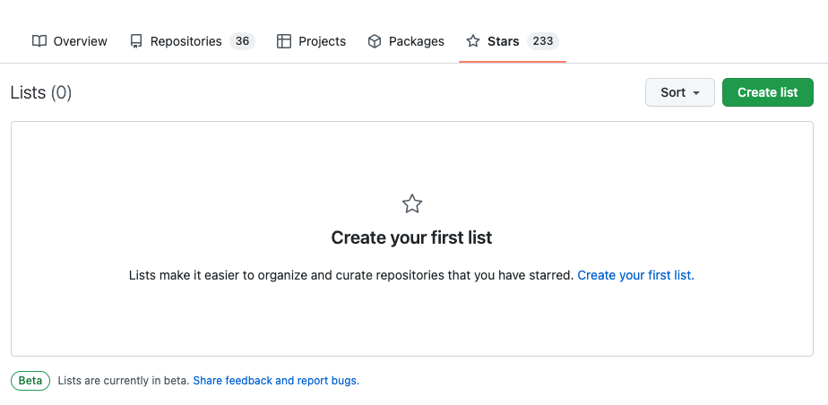
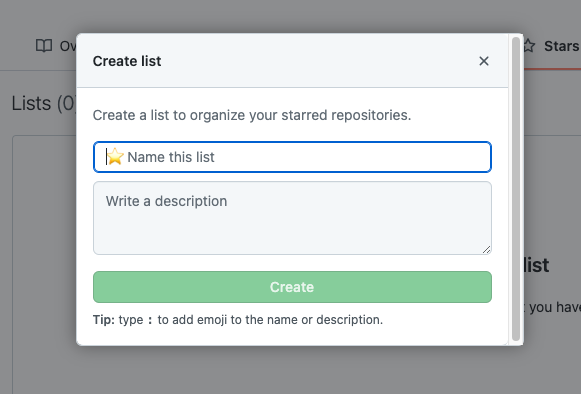
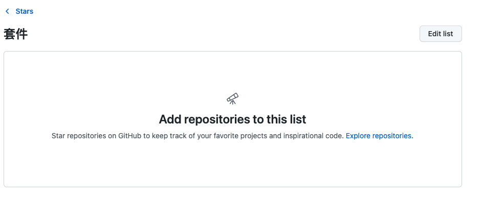
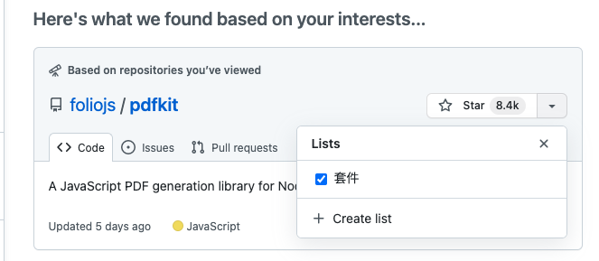

# 一天一套件，工作沒煩惱 - Github star

## 什麼是 Github star

今天比較特別，因為鐵人賽也到尾聲了，想說來介紹一下 Github star，Github star 其實就跟 instagram 的 like 一樣，可以針對你喜歡的專案給他一個 like，讓開發者更有動力去做開發

## 環境建設

首先你需要有一個 Github 帳號

## 什麼是 Github

GitHub 是一個線上軟體原始碼代管服務平台，使用 Git 作為版本控制軟體，有趣的是中國自己也推出了一個類似 Github 的平台 - Gitee(碼雲)，對於 Github 跟 Gitee 差異有興趣的讀者，可以參考[這篇文章](https://technews.tw/2020/08/26/china-github-gitee/)

## 建立一個 Github star list

Github 提供了 list 功能，可以讓開發者去針對個人喜好去安排套件位置，方便下次要使用時，可以迅速找到

進入個人 Github，點擊 star，並且點擊 create list

並且建立一個 list 名稱

這邊我建立一個 list 叫套件，那我們現在要將喜歡的套件加到這個 list 中，所以需點擊一下`Explore repositories`

進入頁面後，就可以看到很多專案，那就自己挑喜歡的套件加入 list 中吧

## 結語

以上就是今天的文章拉，各位讀者不妨快去 Github，把自己喜歡的套件整理成一個 List 吧
