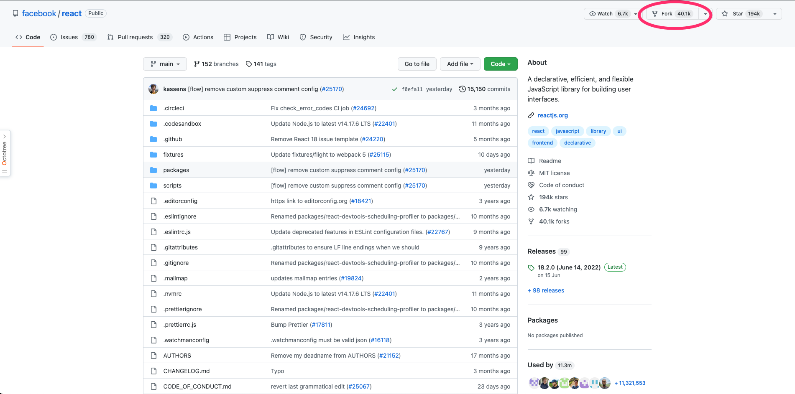
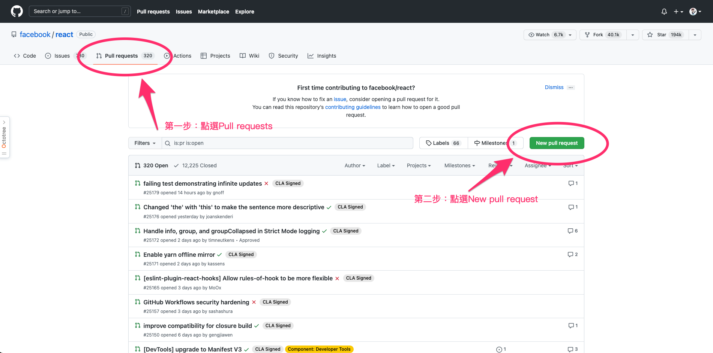
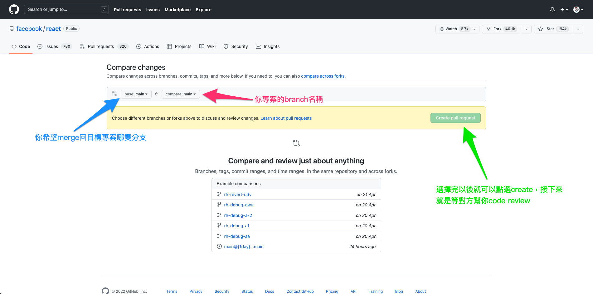
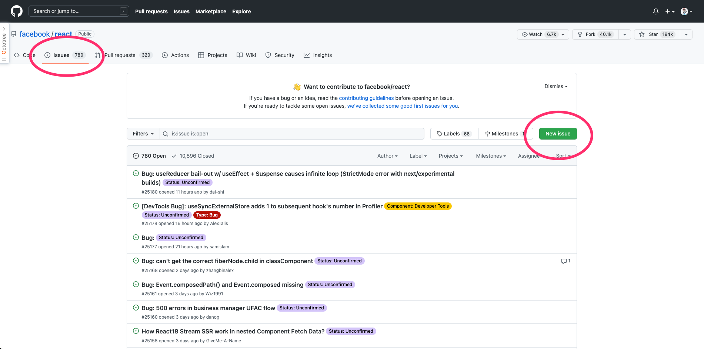

# 一天一套件，工作沒煩惱 - 對套件發 PR

在開始介紹套件之前，我想先寫一下如何對套件發 PR, 或是 issue

## 為什麼要對套件發 PR

因為一個套件不可能一切完美，有可能會錯誤或是有功能還沒加入，這時候你可以發 PR 或是 Issue 給維護套件的團隊，千萬不要怕去問問題，或是發 PR，因為你的問題可能也是別人的問提，不過因為 Github 上幾乎都是使用英文，所以在上傳前可能要先 Run 過一次

## 如何發 PR

不過在講發 PR 之前，要先說一下，發 PR 會需要用到 Git，所以如果對 Git 不熟悉的讀者，可以參考[猴子都懂的 Git](https://backlog.com/git-tutorial/tw/)，個人覺得篇幅小，且有搭配圖片，算是做得不錯

基本上發 PR 我會分成幾個步驟:

### fork

點選圈起來的按鈕，這時候你的個人 Github 裡面會有跟這個專案一模一樣的新專案

### 拉分支

這個步驟我認為是看個人習慣，就好像如果只有我一個人維護度專案，感覺就沒有必要去拉分支，不過筆者自己會拉

### push origin 分支名稱

將寫好的 code，並回遠端專案中

### pull requests

基本上當要發 PR 時，你的專案裡面應該會有一筆變動，這時候到目標專案，點選 pull requests

以上就是如何發 PR，那街下來我們來說說怎麼發 Issue

## 如何發 Issue

跟發 PR 一樣，點選圈起來的部分

且進入畫面後就說明你的問題，這邊我們就不多做說明

## 結語

這邊要提醒讀者，有些比較大型的專案，有自己的規則，要先看清楚 README.md(或是 WIKI) 免得好的想法就石沈大海了

> 以上就是今天的內容，如果有任何錯誤，歡迎留言在下方～～
