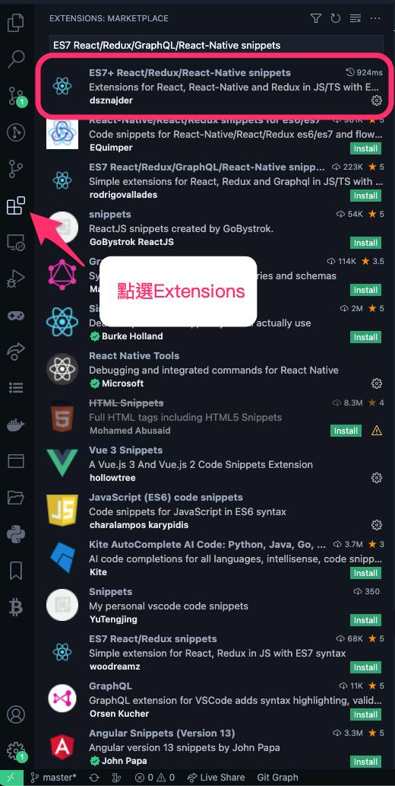
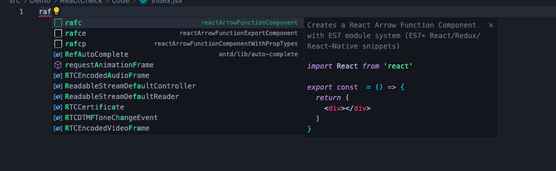

# 一天一套件，工作沒煩惱 - ES7 React/Redux/GraphQL/React-Native snippets

今天要推薦的是 vscode 裡的套件：[ES7 React/Redux/GraphQL/React-Native snippets](https://marketplace.visualstudio.com/items?itemName=rodrigovallades.es7-react-js-snippets)

## 為什麼需要這個套件？

這篇我會以 React 觀點來看這個套件，不過這個套件不只可以在 React 中使用，也可以在 GraphQL, React-Native 中使用

相信寫過 React 的讀者，都清楚 React 在建立 Component 時，每次都要寫下方程式碼，是不是很麻煩？所以今天加入這個套件以後，我們只要輸入幾個字就可以達到一樣的效果

```js
import React from "react";

const Index = () => {
  return <div>index</div>;
};

export default Index;
```

## 環境安裝

按照圖片標示，並選擇第一個(圈起處)安裝



## 怎麼使用

首先先到 React 專案中，創立一個 file

並且輸入 `raf`，這時候應該會看到一個提示



這邊我們會看到三個相關提示，我們可以針對我們的需求去選擇

### rafc -> reactArrowFunctionComponent

```js
import React from "react";

export const index = () => {
  return <div>index</div>;
};
```

### rafce -> reactArrowFunctionExportComponent

```js
import React from "react";

const index = () => {
  return <div>index</div>;
};

export default index;
```

### rafcp -> reactArrowFunctionComponentWithPropTypes

```js
import React from "react";
import PropTypes from "prop-types";

const index = (props) => {
  return <div>index</div>;
};

index.propTypes = {};

export default index;
```

> 是不是感覺很方便？

不過這邊筆者要提醒一下，因為這個語法是針對 file 名稱去生成 Component 名稱的，所以記得如果你的 file 是命名小寫，記得要在 Component 裡面改成大寫

相信有些讀者不太清楚什麼意思

簡單來說，如果你的 file 叫 `index.jsx`，那麼你使用 `rafce` 語法，他會生成的程式碼是：

```js
import React from "react";

const index = () => {
  return <div>index</div>;
};

export default index;
```

反之，如果你的 file 叫 Index.jsx，哪麼你的程式碼會長這樣:

```js
import React from "react";

const Index = () => {
  return <div>index</div>;
};

export default Index;
```

以上是這個套件的部分內容，有興趣的讀者可以去[官網](https://marketplace.visualstudio.com/items?itemName=rodrigovallades.es7-react-js-snippets)看看，寫得非常詳細，一樣有任何問題都歡由在下方留言

那我們明天見~~
