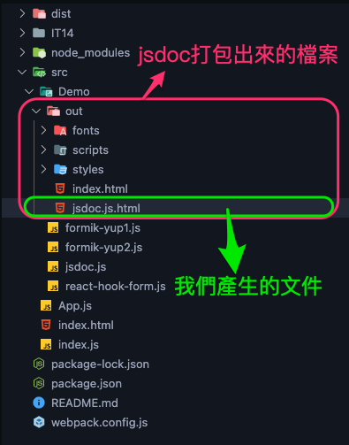
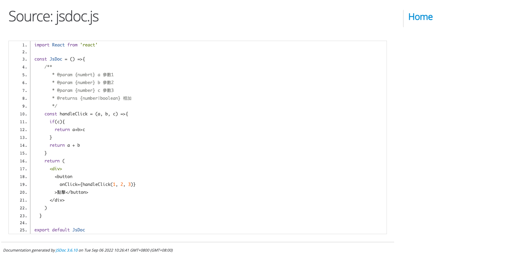

# 一天一套件，工作沒煩惱 - jsdoc

今天不介紹表單驗證了，改介紹文件生成器 - jsdoc

## 什麼是 jsdoc

jsdoc 是透過註解可以自動生成網頁版的文件的套件

## 為什麼需要 jsdoc?

因為今天大家都知道，在開發 js 時，很常遇到兩個問題: 型別不確定，之前寫的東西一個月後就看不懂，所以良好的註解及開發文件對減少開發時間與降低維護 JS 代碼成本可說是功不可沒，而 jsdoc 就是透過註解去生成文件

題外話: jsdoc 的[官網](https://jsdoc.app/)真的是很久以前的文件，希望之後可以更新一下，不然看了也是辣眼睛啊

## 環境安裝

```js
npm install jsdoc
```

記得安裝 JSDoc 之前須安裝 Node.js 8.15.0 以上(現在應該也沒人用這麼低的版本了吧...)

## 如何使用

```js
/**
 *
 * @class JS-DOC
 */
const JSDOC = () => {
  /**
   *
   * @memberof JS-DOC
   * @method Test
   * @param {numbrt} a 參數1
   * @param {number} b 參數2
   * @param {number} c 參數3
   * @returns {number|boolean} 相加
   */
  const handleClick = (a, b, c) => {
    if (c) {
      return a + b > c;
    }
    return a + b;
  };
  return (
    <div>
      <button onClick={handleClick(1, 2, 3)}>點擊</button>
    </div>
  );
};

export default JSDOC;
```

今天假設我們要對 handleClick 這個 function 作注釋，我們可以針對傳進去的參數下註釋，例如:

```js
@param {string} title - The title of the book.
```

這代表有一個參數，叫 title，並且是 string 型別，我們預計會回傳 string

我們可以給文件加入 tag，方便之後做瀏覽

最外層加入

```js
@class JS-DOC
```

並在特定 function 中加入

```js
@memberof JS-DOC
```

那麼該 function 就會在 JS-DOC tag 裡面被找到

## 生成文件

這時候要到你的目錄下找到該文件，然後前面加上 jsdoc

例如：我的檔案是放在 src/Demo 下面，那我可以這樣下

```
jsdoc src/Demo/jsdoc.js
```

這時候，你應該會看到有一個檔案叫`out`，這是 jsdoc 幫我們生成的檔案，打開裡面就會有我們生成的文件了



打開以後，就可以看到文件了



## 結語

不知道現在還有沒有讀者的團隊會去寫文件？筆者自己的團隊曾經有寫過一段時間，後來嫌麻煩，增加開發時間，也就沒有再更新了

> 以上就是今天的文章，有問題都歡迎在下方留言
