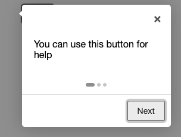

# 一天一套件，工作沒煩惱 - intro.js

今天要介紹的是一個導覽套件 - intro.js

## 什麼是 intro.js

intro.js 是一個導覽套件，他可以讓你的使用者在初次進入專案時，有一個簡單的動態網站介紹

## 環境安裝

```js
npm install intro.js --save
npm install intro.js-react
```

(注意一下，這邊是兩個都要下載，不是擇一喔)

疑？不是介紹 intro.js 嗎？怎麼會多一個 react?主要是因為 react 不建議我們直接去對 DOM 進行操作，所以他們新增了新的套件叫 intro.js-react，專門給 react 的開發者

## 怎麼使用？

首先你必須知道 intro.js 就只有兩個 Component: Steps, Hints，金天只會講 Steps，明天會講 Hints

### Steps

```js
<Steps
  enabled={stepsEnabled}
  steps={steps}
  initialStep={initialStep}
  onExit={this.onExit}
/>
```

首先先說一下，這幾個參數

### enabled -> 是否啟用

簡單來說就是要不要使用 intro.js 功能，這邊建議不要寫死，不然就會遇到關不掉或是沒顯示的問題

### steps -> 步驟

這邊需搭配 css，透過 css 綁定，來做畫面特效

```js
const steps = [
  {
    element: "#help",
    intro: "You can use this button for help",
    position: "right",
  },
  {
    element: "#about",
    intro: "You can use this button to get more information",
  },
  {
    element: "#contact",
    intro: "You can use this button to contact us",
  },
];

<button id="help">Help</button>
<button id="about">About</button>
<button id="contact">Contact Us</button>
```

- element
  要綁定的內容，記得 class 跟 id 寫法，不一樣要特別注意
- intro
  要顯示的內容

- position
  這是對話筐的開口位置，以 right 來說，會長這樣：



### initialStep

從哪一步開始？預設是從 0 開始，所以如果這個欄位填 1，就會從第二步開始

```js
const steps = [
  {
    element: "#help",
    intro: "You can use this button for help",
    position: "right",
  },
  {
    element: "#about",
    intro: "You can use this button to get more information",
  },
  {
    element: "#contact",
    intro: "You can use this button to contact us",
  },
];
```

以程式碼來說，如果選擇 0，就會從`#help`開始，那如果選擇 1，就會忽略`#help`，直接從`#abou`開始

### onExit

點擊叉叉會產生什麼事

## 成品


## 結語

intro.js 是我覺得蠻特別的套件，平常沒什麼機會用到公司專案裡面，但是如果進入頁面可以有個簡單的導覽 UX 應該會蠻好的，可以幫助使用者快速了解狀況

> 以上就是今天的文章，一樣有問題歡迎在下方留言
